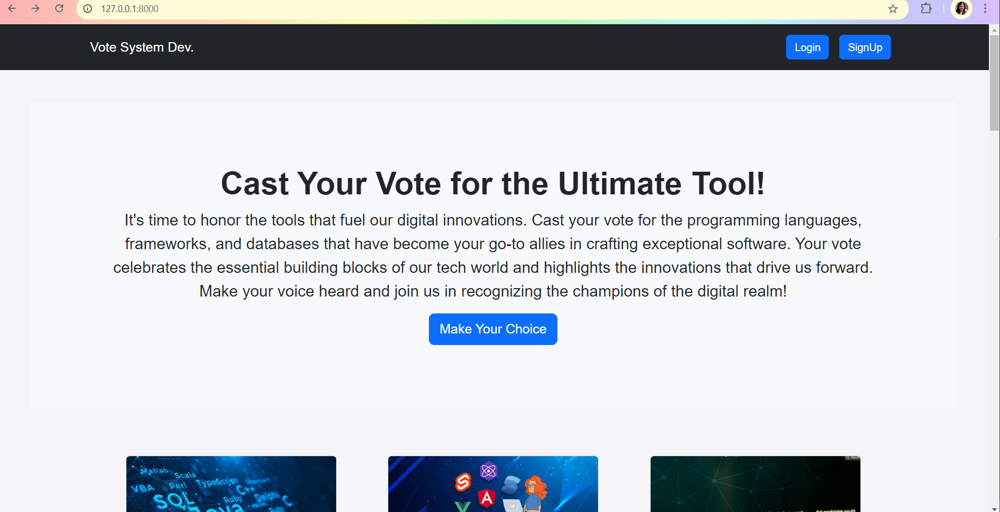
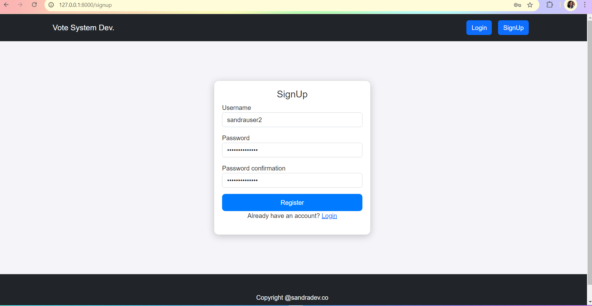
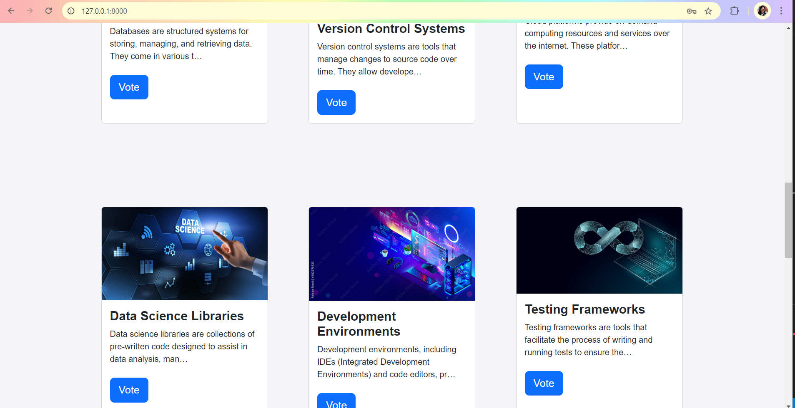
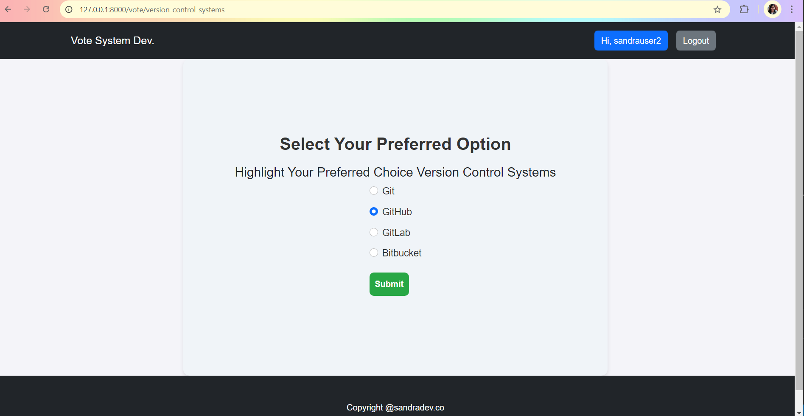
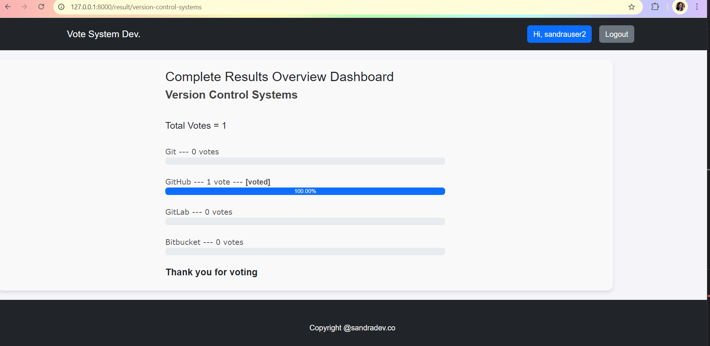
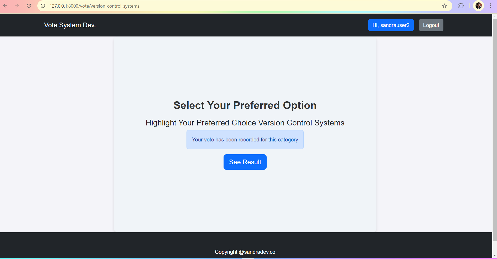

#CodeElect
Vote System Dev is a platform to cast your vote for the best programming languages, frameworks, databases, and other essential tools in modern software development. Celebrate the technologies that drive digital innovation!

Categories
Programming Languages: Vote for the most impactful languages.
Frontend Frameworks: Choose the best frameworks for creating dynamic UIs.
Backend Frameworks: Select the top tools for robust server-side development.
Databases: Pick the most reliable systems for data management.
Version Control Systems: Cast your vote for the best collaborative tools.
Cloud Platforms: Vote for the platforms providing the best cloud services.
Data Science Libraries: Choose the top libraries for data analysis.
Development Environments: Select the IDEs and editors that boost productivity.
Testing Frameworks: Vote for the most reliable testing tools.
Containerization Tools: Pick the best tools for creating isolated environments.
CI/CD Tools: Vote for the top tools in continuous integration and deployment.
APIs: Select the best APIs for integrating applications.
Security Tools: Vote for tools that best protect software and systems.
Project Management Tools: Choose tools that streamline project planning and tracking.
Message Brokers: Select tools that enable effective communication in distributed systems.
Contributing
Contributions are welcome! Submit issues or pull requests for additional categories or improvements.

License
Licensed under the MIT License. See the LICENSE file for more details.

